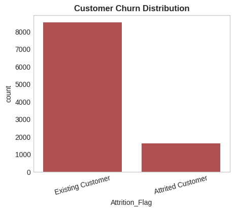
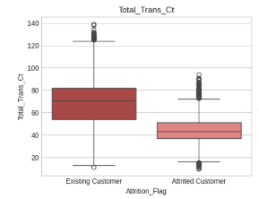
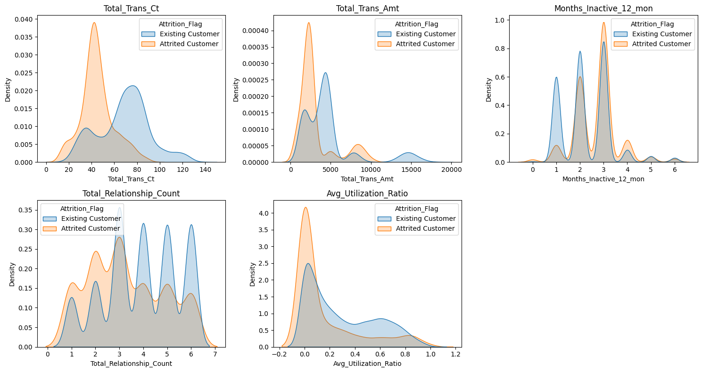
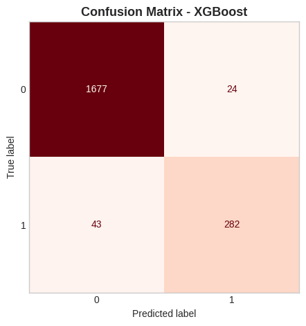
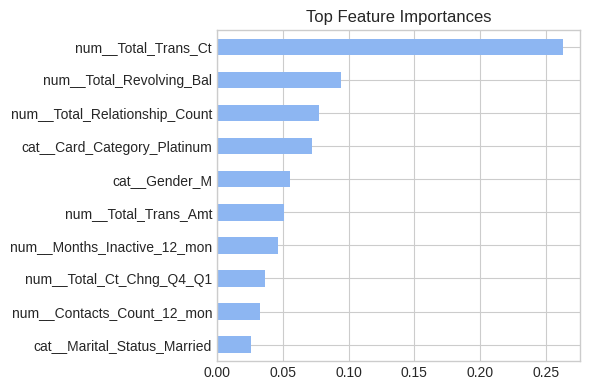

# Bank Customer Churn Prediction

## Project Overview

This project builds a machine learning pipeline to predict customer churn for a bank’s credit card portfolio. The goal is to identify customers at risk of leaving using demographic, behavioral, and transactional data.

The project focuses on both predictive performance and interpretability to support data-driven customer retention strategies.

## Objective

- Predict whether a customer will churn (leave the credit card service)
- Identify key behavioral drivers of churn
- Compare multiple machine learning models
- Select the best-performing model for generalization

## Dataset

- ~10,000 customer records
- 21 original features
- 19 features used after preprocessing
- Target: `Attrition_Flag` (Existing vs Attrited Customer)

Features include:

- Demographics (age, gender, education, income)
- Account activity (months inactive, relationship count)
- Transaction behavior (amount, count, utilization)

## Data Processing

- Removed identifier column (`CLIENTNUM`)
- Handled categorical "Unknown" values as a separate category
- Checked and retained outliers (no removal due to data loss risk)
- One-hot encoding for categorical variables
- Feature scaling for numerical variables
- Addressed class imbalance using SMOTE

## Exploratory Data Analysis (EDA)

### Customer Churn Distribution

**Insight:** The dataset is moderately imbalanced, with significantly fewer churned customers compared to retained customers. This highlights the need for imbalance-handling techniques such as SMOTE.

### Customer Transaction Behavior

**Insight:** Customers who churn exhibit significantly lower transaction counts and transaction amounts, indicating reduced engagement prior to leaving. Declining activity is a strong early warning signal of churn.

### Behavioral Distribution Comparison

**Insight:** Clear separation between churned and retained customers is observed across key behavioral features. Transaction-related variables show strong divergence, reinforcing their predictive importance.

### Key Insights

- Strong class imbalance between churned and retained customers  
- Churn is strongly associated with:
  - Lower transaction activity  
  - Higher inactivity periods  
  - Fewer bank relationships  
- Behavioral features are more predictive than demographic features  

## Machine Learning Models

The following models were evaluated:

- Logistic Regression  
- Decision Tree (CART)  
- Random Forest  
- XGBoost  
- Support Vector Machine (SVM)  

## Best Model

**XGBoost** performed best across:

- Precision  
- Recall  
- F1-score  

It captured nonlinear relationships in customer behavior more effectively than other models.

## Model Performance

### Confusion Matrix

**Insight:** The model effectively identifies churned customers while maintaining a balance between false positives and false negatives, which is critical for retention strategies.

### Feature Importance

**Insight:** Transaction activity and engagement metrics are the strongest predictors of churn. Features such as transaction count, transaction amount, and inactivity dominate model decisions.

## Key Results

- Transaction activity was the strongest predictor of churn  
- Inactive customers were significantly more likely to churn  
- Behavioral features were more important than demographic features  
- Model generalization was strong (small train-test performance gap)  

## Business Impact

This model can help financial institutions:

- Identify at-risk customers early  
- Improve customer retention strategies  
- Target interventions (offers, engagement campaigns)  
- Reduce churn-related revenue loss  

## Tech Stack

- Python  
- Pandas, NumPy  
- Matplotlib, Seaborn  
- Scikit-learn  
- XGBoost  
- Imbalanced-learn (SMOTE)  

---

## Author

Selam Saleh
